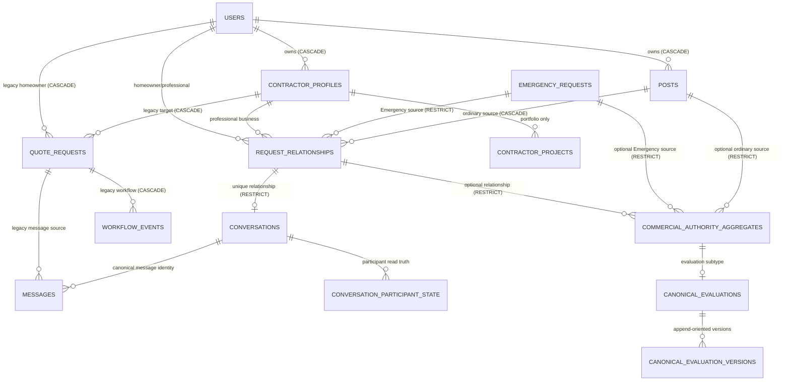

# MC-CONVERSATION-COMMERCIAL-JOB-REQUEST-001A

# Canonical Job Request and Commercial Workflow Truth Map

**Evidence date:** 2026-08-06

**Execution mode:** Read-only cross-repository investigation; this document is the only authorized change.

**Frontend root (`<frontend>`):** `/Users/williammolina/meetro-client`

**Backend root (`<backend>`):** `/Users/williammolina/meetro-server/meetro-server`
**Final determination:** **FAIL — Active authority contradictions or unsafe truth prevent implementation.**

Evidence labels used throughout:

- **VERIFIED** — directly established by current repository source, migration, or test evidence.
- **PARTIAL** — some required authority exists, but the complete contract does not.
- **INFERRED** — conclusion follows from multiple verified facts but is not declared directly.
- **MISSING** — no repository evidence for the required authority was found.
- **CONTRADICTORY** — two active paths or contracts claim incompatible truth.
- **LEGACY** — compatibility behavior exists but is not the required canonical authority.
- **BROWSER-LOCAL** — the browser can store or derive the value; this is not backend authority.

Migration files are evidence of intended schema evolution only. This investigation did not access a database and does not claim that any migration is deployed in any environment.

## 1. Executive Summary

The ordinary Request Help path has a real backend-owned request foundation: authenticated `POST /posts` creates a server-generated `posts.id`, derives `user_id` from `req.user.id`, validates canonical service identifiers, stores location and governed photo metadata, and returns the stored row. Owner reads, limited owner edits, and idempotent cancellation are backend-authoritative. **VERIFIED** — `<frontend>/src/pages/Upload.jsx:489-655`, `<backend>/index.js:1412-1678`, `<backend>/server/requests/requestLifecycle.js:43-114`, and migrations `202607050001`, `202607190002`, and `202607200001`.

That foundation does not yet form a coherent commercial workflow. The highest-severity contradiction is that authenticated `GET /professional-request-opportunities` is a mutating command: it creates or promotes an `active` `request_relationships` row and creates a canonical conversation for every eligible professional whose opportunity list is read. The explicit response route separately creates `pending` relationships, and homeowner acceptance separately claims to be the transition that activates the relationship and creates the conversation. **CONTRADICTORY** — `<backend>/server/requests/professionalOpportunityService.js:26-223`, `<backend>/server/relationships/requestRelationshipService.js:13-201,562-725`, and `<backend>/test/requestLifecycle.test.js:378-444`.

A second active request identity exists in parallel. Contractor profile pages create `quote_requests` directly with a client-supplied `contractor_id`; those records are not foreign-keyed to `posts`, `request_relationships`, canonical conversations, Evaluation, or commercial aggregates. Their messages and `workflow_events` form a separate legacy workflow. **CONTRADICTORY / LEGACY** — `<frontend>/src/pages/ContractorDetails.jsx:398-441`, `<backend>/index.js:2419-2747`, and `<backend>/migrations/202607050001_initial_schema_baseline.sql:44-77`.

The commercial authority and canonical Evaluation migrations provide a strong additive foundation, but runtime Evaluation is deliberately Emergency-only and fails closed for ordinary requests. Quote, exact-version customer decision, Commercial Authorization, payment requirements, financial evidence, allocations, operational Project, Invoice, and permanent ordinary-request History are not implemented as canonical runtime domains. Browser-local legacy workflow projections and reachable preview/workflow surfaces still contain local quote, invoice, paid, project, completion, closure, and history concepts; production storage policy contains many of them, but not every source writer is eliminated. **PARTIAL / MISSING / BROWSER-LOCAL**.

Implementation must not proceed as if the provisional roadmap were additive feature work. Relationship and opportunity authority, canonical request identity convergence, legacy route containment, cancellation propagation, and governance status must be resolved first.

## 2. Governance Authority

The task-provided governing hierarchy is: Meetro Vision → Meetro Constitution → Meetro Platform Constitution → canonical engine charters → `MC-PLATFORM-STANDARD-001` → engine-specific standards → Commercial Authority Charter → approved handoffs → roadmaps → milestones → runtime → certification → production. The task assigns authoritative questions to Relationship, Communication, Workflow, Authorization, Project, History, and Intelligence engines and prohibits creating a new engine or redefining their ownership.

Repository evidence adds an important status qualification:

- **VERIFIED:** `<frontend>/docs/PlatformConstitution/PLATFORM_INVARIANTS.md:16-27` states single-owner and “reads remain reads” principles consistent with the task.
- **CONTRADICTORY:** `<frontend>/docs/PlatformConstitution/README.md:5-25`, `MEETRO_PLATFORM_CONSTITUTION.md:544-547`, and `RATIFICATION_RECORD.md:11-20` describe the repository-local Platform Constitution assembly as a revised freeze candidate and not ratified/authorized. It cannot independently prove the effective governing status asserted by the task.
- **MISSING:** no standalone repository document for `MC-PLATFORM-STANDARD-001`, the named canonical engine charters, or the Commercial Authority Charter was found in either repository. Traceability constants in `202608010001_create_commercial_authority_foundation.sql:219-229` reference `MC-WORKFLOW-001C/001D`, but those references do not supply the absent governing text.
- **VERIFIED:** the master handoff and this milestone directive are task-provided authority for this investigation; they are not represented as runtime implementation evidence.

This document therefore applies the supplied ownership model as the review standard while reporting the repository-local ratification mismatch as a constitutional blocker. It does not ratify, amend, or supersede any governance artifact.

## 3. Repository Baseline

### Frontend pre-state

| Fact | Evidence |
|---|---|
| Absolute path | `/Users/williammolina/meetro-client` |
| Branch | `main` |
| HEAD | `950239b7c1ec13a48faa4b2f930fe2960a242eb7` |
| Upstream / upstream HEAD | `origin/main` / same commit |
| Remote branch HEAD | same commit, verified with `git ls-remote` |
| Ahead / behind | `0 / 0` |
| Index | clean |
| Working tree | clean |
| Untracked files | none |
| Active Git operation | none found (merge, rebase, cherry-pick, revert, or bisect) |
| Truth-map pre-state | file absent; not pre-modified |

### Backend pre-state

| Fact | Evidence |
|---|---|
| Absolute path | `/Users/williammolina/meetro-server/meetro-server` |
| Branch | `main` |
| HEAD | `a3d12d48ac0b556ae0b0723b2036e21d7147c05a` |
| Upstream / upstream HEAD | `origin/main` / same commit |
| Remote branch HEAD | same commit, verified with `git ls-remote` |
| Ahead / behind | `0 / 0` |
| Index | clean |
| Working tree | clean |
| Untracked files | none |
| Active Git operation | none found (merge, rebase, cherry-pick, revert, or bisect) |

No relevant pre-existing local changes required preservation. The exact task ID, requested filename, and similarly named Job Request commercial truth maps were searched in both repositories; no duplicate canonical document was found.

## 4. Investigation Method

The investigation used repository-only evidence:

1. Verified Git identity, upstream/remote parity, index, worktree, untracked files, and operation markers in both repositories.
2. Searched both repositories broadly with `rg`/`rg --files` for request, relationship, opportunity, conversation, Evaluation, quote, payment, invoice, project, workflow, history, media, location, status, browser storage, generated identity, and compatibility terms.
3. Traced each active frontend request-creation surface through state, validation, transport, route, server actor derivation, SQL write, response, and downstream projections.
4. Read relevant source and migration files rather than treating filenames or UI labels as semantic proof.
5. Classified browser storage by whether it is temporary presentation state, routing/cache state, production-contained legacy state, unsafe authority, QA/test-only, or dead/latent code.
6. Ran non-mutating focused suites: 226 backend tests passed and 165 frontend tests passed. The commands are recorded in section 32. No build was needed to establish the contracts, so no build-generated files were created.
7. Treated passing tests as evidence only for what they assert. A test that asserts an architecturally contradictory side effect is classified “covered but contradictory,” not as certification.

Evidence limitations: no database, staging, production, environment variables, live API, runtime account, or deployment metadata were accessed. Deployed schema and data state are unknown.

## 5. Current Job Request System Map

### Canonical Request Help path

```text
Upload.jsx in-memory form / optional browser-prepared assistant draft
  → frontend validation and canonical service-ID selection
  → optional signed Cloudinary uploads scoped to authenticated user folder
  → authenticated POST /posts
  → req.user.id is owner; server validates fields and media metadata
  → INSERT posts; server SERIAL id becomes canonical request identity
  → backend response is required before success
  → owner GET /posts / GET /posts/:id hydrates My Requests
  → open request becomes discoverable by eligible professionals
  → GET /professional-request-opportunities (currently mutates)
  → active relationship + conversation created per eligible viewer
```

### Intended explicit response path that conflicts with discovery

```text
POST /professional-request-opportunities/:postId/respond
  → owned professional profile + open request + eligibility recheck
  → pending request_relationships row
  → homeowner GET /my-request-relationships
  → accept pending relationship
  → active relationship + canonical conversation in one transaction
```

### Parallel legacy request path

```text
ContractorDetails.jsx quote form
  → POST /quote-requests with client-selected contractor_id
  → quote_requests row (not linked to posts)
  → legacy /messages and /workflow-events keyed by quote_request_id
  → browser-routed legacy conversation/workflow presentation
```

Request submission creates neither canonical History nor a Workflow/Project aggregate. Canonical ordinary Evaluation is unavailable. The commercial authority schema can represent ordinary source aggregates, but no generic public commercial route turns that capability into Quote, decision, Authorization, payment, Invoice, or Project runtime behavior.

### Cross-repository field and contract mismatches

| Field/concept | Frontend behavior | Backend/persistence truth | Classification |
|---|---|---|---|
| `post_type`, submitted `status` | `Upload.jsx` sends compatibility values | validator accepts them, but insert fixes status to `open` and stores no `post_type` | **LEGACY / ignored input** |
| direct-request fields | populated from local storage when Hire Again context exists | backend rejects direct request with `DIRECT_REQUEST_UNAVAILABLE` | **BROWSER-LOCAL / fail-closed mismatch** |
| `category` vs `request_category` | both sent; service selector also sends domain/specialty | all four persist; category concepts overlap and context is not represented | **PARTIAL / duplicate naming** |
| unit/access | submitted and persisted on create | owner serializer returns them; edit route does not allow updates; no selected-professional projection | **PARTIAL** |
| request photos | upload metadata created before request; ordered envelope submitted | embedded JSONB persists; arbitrary/foreign media rejected | **PARTIAL but governed** |
| professional opportunity `location` | needed for matching | selected in service query but deliberately omitted from response | **VERIFIED privacy projection** |
| conversation ID | frontend requires canonical positive ID | opportunity GET manufactures it before response/selection; respond serializer still reports unavailable | **CONTRADICTORY** |
| contractor-profile quote form | sends `contractor_id`, project title/description/location | creates unlinked `quote_requests` row | **LEGACY identity fork** |
| accepted/scheduled/completed/paid labels | present in frontend/legacy workflows | no ordinary canonical backend status/command | **BROWSER-LOCAL / LEGACY** |
| Evaluation source | frontend canonical adapter supports source context | backend rejects ordinary source and accepts qualifying Emergency only | **VERIFIED fail-closed boundary** |

## 6. Canonical Engine Ownership Matrix

| Object/action | What/where it exists | Current owner | Required owner | Authority/alignment | Duplication, browser, legacy, or missing state | Migration need | Compatibility need | Required action |
|---|---|---|---|---|---|---|---|---|
| Ordinary Job Request identity/narrative | `posts`; request routes in `<backend>/index.js` | Route-local request service / database | Project Engine for request/project body; Authorization for commands | **PARTIAL** backend identity | `quote_requests` duplicates request identity | History/version schema definitely; replacement identity not justified | contain `quote_requests` without silent promotion | Declare `posts` canonical or approve explicit supersession |
| Request create/edit/cancel authority | SQL routes + auth middleware | Route-local authorization | Authorization + Project/Workflow command boundary | **PARTIAL** | no browser success authority; History missing | revision/History storage definitely | preserve current payload/read compatibility | preserve server actor; add command/History contracts |
| Opportunity eligibility | `professionalCanSeeRequest` | Request helper | Relationship eligibility + Authorization | **PARTIAL** fail-closed match | location is internal match input | none for read-only correction | retain current safe projection | separate observation from mutation |
| Professional response | pending `request_relationships` path | Relationship service, contradicted by opportunity service | Relationship; Communication for transmitted introduction | **CONTRADICTORY** | GET independently creates active rows | single-selected constraint likely, contract-dependent | reconcile existing rows explicitly | make explicit response the only response command |
| Professional selection | accept route sets `active` | Relationship service, contradicted by discovery | Relationship + Authorization | **CONTRADICTORY** | every eligible viewer may already be active | likely partial unique selected index | define handling of pre-existing active rows | make homeowner selection sole activation |
| Conversation | `conversations`; canonical message routes | Communication service, invoked by two paths | Communication Engine | mechanics aligned; timing **CONTRADICTORY** | legacy quote messages coexist | none for timing correction | maintain separate legacy message identity | create only from authorized relationship transition |
| Request status | `posts.status` (`open`, `cancelled`) | Request route | Workflow Engine | **PARTIAL** availability only | many browser presentation statuses | likely Workflow schema later | do not promote legacy status | define lifecycle or explicitly bound availability state |
| Evaluation | commercial aggregate + canonical Evaluation service | Authorization service | Authorization Engine | aligned for Emergency; ordinary **MISSING** | Emergency-only, browser Evaluation contained | existing schema may support handoff; no new SQL yet proven | no legacy Evaluation promotion | keep ordinary unavailable until prerequisites exist |
| Findings/recommendations | JSON arrays in Evaluation versions | Evaluation service | Authorization/Evaluation domain + History | **PARTIAL** | no independent identity/linkage | item schema only if contract requires it | preserve version payload compatibility | decide whether embedded version structure is sufficient |
| Quote | aggregate type declaration; legacy quote-request; local preview | unimplemented / legacy UI | Authorization/Commercial Authority; Communication presentation | **MISSING / LEGACY** | “quote request” and Quote naming collision | definite domain schema before implementation | preserve legacy request-for-quote separately | contract identity/version/issuance first |
| Customer decision | aggregate type declaration only | Unimplemented | Authorization Engine | **MISSING** | browser approval labels | definite domain/evidence schema | never promote local approval | require exact-object/exact-version evidence |
| Commercial Terms/deposit | no canonical runtime | Unimplemented | Authorization Engine | **MISSING** | local calculations/presentation | definite if capability proceeds | keep previews unavailable | contract versioned terms/backend calculation |
| Payment/evidence/allocation | no canonical runtime | Unimplemented | Payment authority + Authorization reevaluation | **MISSING** | browser “paid” writers | definite if capability proceeds; provider-specific details unapproved | never promote local paid state | provider evidence/allocation contract first |
| Invoice | aggregate type declaration; local preview | Unimplemented / legacy UI | Invoice/commercial domain + Authorization/History | **MISSING** | workflow card can mark paid locally | definite if capability proceeds | keep preview separate | keep unavailable; contain authority-like writer |
| Operational Project | no operational table; `contractor_projects` is portfolio | Browser legacy projections | Project Engine | **MISSING** | active/completed browser projects | definite before Project claims | portfolio must remain separate | create only after Commercial Authorization |
| Workflow | `posts.status`; legacy `workflow_events`; browser stages | Duplicated route/client owners | Workflow Engine | **CONTRADICTORY / LEGACY** | multiple stage engines | likely canonical transition schema | legacy events remain unpromoted | define explicit commands later |
| Permanent History | Evaluation evidence for implemented commands only | Partial commercial evidence | History Engine | ordinary flow **MISSING** | local history/completion projections | definite append-only evidence | retain legacy provenance, not authority | record accepted events after command contracts |
| AI assistance | assistant draft/context helpers | Browser advisory utilities | Intelligence Engine, advisory only | aligned only while non-authoritative | local draft consumed before submission | none | explicit submission promotion boundary | preserve as draft assistance only |

## 7. Request Creation Truth Map

The primary active surface is `<frontend>/src/pages/Upload.jsx`. It keeps form fields in React state, derives canonical matching identifiers, optionally uploads governed photos, and posts to `/posts`. Success requires `response.ok` plus a positive canonical server ID via `getCanonicalCreatedRequest`; it does not create a browser request projection. The server allowlists fields, rejects direct-request mode, derives `user_id` from `req.user.id`, fixes status to `open`, inserts `posts`, and serializes the stored row. **VERIFIED**.

The same payload includes compatibility fields (`post_type`, `status`, and direct-request fields). The backend explicitly rejects `direct_request` and otherwise does not let submitted status control persistence. A browser-local `directRequestMode` can therefore route the user into a known unsupported contract, but cannot fabricate success. **PARTIAL / BROWSER-LOCAL**.

The second active creation route is `ContractorDetails.submitQuoteRequest` → `POST /quote-requests`. It persists a separate request-like record, trusts the client-selected target `contractor_id` subject only to FK existence, and does not prove the selected profile was the profile currently displayed through an exact-object authorization check. **LEGACY / CONTRADICTORY**.

### Decision gates 1–9

| # | Question | Direct answer |
|---:|---|---|
| 1 | What database record currently represents an ordinary Job Request? | **VERIFIED:** a `posts` row is the primary canonical ordinary Request Help record. A `quote_requests` row separately represents a legacy direct-to-contractor request and creates an identity fork. |
| 2 | Which table or tables store it? | **VERIFIED:** `posts`; **LEGACY:** `quote_requests` stores the parallel profile-origin request. |
| 3 | Which backend route creates it? | **VERIFIED:** `POST /posts`; **LEGACY:** `POST /quote-requests`. |
| 4 | Which frontend surface submits it? | **VERIFIED:** `Upload.jsx` submits `/posts`; `ContractorDetails.jsx` submits `/quote-requests`. |
| 5 | Are there multiple creation routes? | **CONTRADICTORY:** yes, two active routes with different schemas and downstream identity. |
| 6 | When does canonical request identity exist? | For Request Help, only after the successful `INSERT posts` response. The assistant/form/photo state before that is not canonical. |
| 7 | Is the request ID server-generated or browser-generated? | **VERIFIED:** `posts.id` and `quote_requests.id` are database `SERIAL` values. Temporary photo/draft IDs may use browser time/blob values but are not accepted as request identity. |
| 8 | Which identity fields are backend-owned? | Authenticated actor/owner (`req.user.id`), persisted request ID, stored status, timestamps, and canonical conversation/relationship IDs are backend-owned. The legacy route still accepts the target contractor profile ID from the client. |
| 9 | Which fields are canonical? | For `posts`: title, description, normalized category/request category, service domain/specialty, location, unit/access text, governed photo metadata, status, and timestamps as returned by the backend. “Canonical” here means repository contract, not deployed-state proof. |

## 8. Request Draft and Submission Truth Map

There is no backend Request Help draft record or resume route. `Assistant.jsx` can place `meetroAssistantRequestDraft` in local storage; `Upload.jsx:253-274` consumes and clears it into form state. Location can be prefilled from local property/request context. Those are preparation aids, not canonical identity or submission truth. Photo blobs exist before request creation because governed upload occurs before `POST /posts`; uploaded asset metadata becomes associated only when embedded into the `posts.request_photos` JSONB field.

Submission is truthful on the main path: duplicate taps are blocked, required title/location/service metadata are checked before upload, failure cleans newly uploaded assets where possible, and success is shown only after backend confirmation. **VERIFIED** — frontend tests `requestHelpSubmission.test.js`, `requestLifecycleAuthority.test.js`, and `requestPhotoMedia.test.js`.

### Decision gates 10–13

| # | Question | Direct answer |
|---:|---|---|
| 10 | Which fields exist only in browser state or browser storage? | **BROWSER-LOCAL:** unsaved form text, selected local files/blob previews, assistant draft metadata, selected property/location hints, `directRequestMode` and direct-target context, and navigation projections. None is canonical until validated and persisted. |
| 11 | Are backend drafts supported? | **MISSING:** no ordinary request draft status, draft table, or draft route exists. |
| 12 | Can users save and resume? | **MISSING:** not authoritatively. Browser assistant preparation can survive locally, but it is not cross-device or backend-owned. |
| 13 | When does opportunity visibility begin? | **VERIFIED:** after the `posts` row is stored with status `open` and matches an owned professional profile’s service and area rules. The first opportunity GET currently also creates relationship/conversation identity, which is the principal contradiction. |

## 9. Request Taxonomy and Context Truth Map

The ordinary request persists `category`, `request_category`, `service_domain`, and `service_specialty`. Frontend selection uses shared canonical service identifiers; backend `validateRequestPayload` normalizes and checks specialty-to-domain compatibility. Professional eligibility uses the owned profile’s `service_specialties` or category and the same compatibility helpers. Focused parity tests cover supported and blocked examples. **VERIFIED** — `<frontend>/src/pages/Upload.jsx:284-359,500-550`; `<backend>/server/requests/requestLifecycle.js:67-99,128-166`; frontend `professionalRequestMatchingParity.test.js`.

There is no canonical ordinary-request context field for homeowner, property-management, commercial, insurance, or warranty context. `request_category` is a service/category identifier, not a customer/commercial context. Evaluation versions have an `evaluation_context` string, but runtime creation is Emergency-only and it does not backfill ordinary-request context. **MISSING**.

## 10. Property and Location Truth Map

`posts.location` is a required free-text field; `unit_number` and `access_notes` are text columns. No normalized Property or Service Location table/FK links the request to an owned property. Frontend prefill may derive from local `selectedProperty`, `selectedProject`, or `selectedHomeownerRequest`, but the backend receives only text and does not verify a property relationship. **PARTIAL / BROWSER-LOCAL**.

Professional matching reads the full stored location internally, but the opportunity serializer excludes `location`, `unit_number`, `access_notes`, and owner ID. Professional relationship inbox and ordinary conversation detail also omit exact location. Therefore the canonical selected professional has no ordinary-flow route to retrieve exact service location, while the legacy `contractor-quote-requests` route returns the `quote_requests.location` to the selected profile owner. **PARTIAL / LEGACY**.

### Decision gates 31–39 — privacy and visibility

| # | Question | Direct answer |
|---:|---|---|
| 31 | Which professionals may discover a request? | Authenticated users with an owned contractor profile whose canonical service domain/specialty and declared service area match an open, non-self request. |
| 32 | What determines eligibility? | Owned profile category/specialties plus service-area/city/postal substring match against request location, canonical domain/specialty compatibility, open status, and non-self ownership. |
| 33 | When is customer identity visible? | Opportunity projection excludes owner identity, but the mutating GET creates a conversation; the professional conversation inbox then exposes a customer display name. Thus identity becomes visible on mere eligible discovery, before explicit response/selection. **CONTRADICTORY / privacy risk.** |
| 34 | When is exact location visible? | On canonical Request Help, only to the owner through `/posts`; it is used server-side for matching and remains omitted even after ordinary relationship activation. On the legacy quote-request path it is visible to the targeted contractor profile owner. |
| 35 | Can unauthorized professionals discover private request information? | Participant/owner queries reject unrelated users, and opportunity projection excludes location/owner ID. However eligibility is computed using raw location and the GET creates participant state for every eligible viewer, broadening access beyond an explicit response/selection. |
| 36 | Does any route trust client-supplied business identity? | **YES — LEGACY:** `POST /quote-requests` accepts `contractor_id`; review creation similarly accepts a target contractor ID but is outside request creation. Canonical response/conversation routes derive the owned profile. |
| 37 | Does any route trust client-supplied requester identity? | **No** on inspected request, relationship, conversation, Evaluation, and legacy quote-request writes: requester/sender actor derives from `req.user.id`. Legacy messages accept a receiver ID but validate it against quote participants. |
| 38 | Is cross-business rejection enforced? | **VERIFIED** on explicit ordinary response, professional inbox/withdrawal, canonical conversation, and Evaluation through owned profile/participant joins. **PARTIAL** on legacy `/quote-requests`, where exact displayed-target authorization is not proven. |
| 39 | Is cross-user rejection enforced? | **VERIFIED** for owned `/posts`, relationship transitions, canonical conversations/messages, and Evaluation. The legacy quote/message/workflow paths are participant-scoped but retain client-authored workflow content. |

## 11. Media Truth Map

Request photos use an authenticated signature endpoint and Cloudinary metadata constrained to the authenticated user folder, approved formats, size, count, purpose, and ordered collection. The browser uses blob URLs only for temporary previews. The backend rejects arbitrary URLs/foreign metadata and stores the ordered media envelope in `posts.request_photos` JSONB, with `image_url` as compatibility projection. **VERIFIED** — `<frontend>/src/utils/requestPhotoMedia.js`, `<backend>/server/media/requestPhotoMedia.js`, `<backend>/index.js:1412-1477,1517-1642`, migration `202607190002_add_post_request_photos.sql`, and focused media tests.

The upload can precede canonical request identity. There is no media table or FK to `posts`; association is embedded metadata. Create failure attempts cleanup. Edit omission preserves the collection, explicit replacement/empty array replaces or clears after backend confirmation, and removed-asset cleanup is best effort after persistence. Cleanup failure can leave an orphaned remote asset but does not reverse confirmed request truth. Production capability remains behind `isRequestPhotoUploadEnabled`; tests state it is production-disabled by default, so repository support does not prove deployment enablement.

### Decision gates 40–47

| # | Question | Direct answer |
|---:|---|---|
| 40 | How are request photos and documents uploaded? | Photos use governed signed Cloudinary upload. No governed ordinary-request document pipeline was found. |
| 41 | Are uploads signed? | **VERIFIED:** yes for request photos. |
| 42 | Is ownership validated? | **VERIFIED:** signature folder and persisted metadata are scoped to authenticated `userId`; foreign metadata fails. |
| 43 | Are media records associated with canonical request identity? | **PARTIAL:** media envelopes are embedded in `posts.request_photos`; there is no separate media record/FK tying each asset to the request. |
| 44 | Can media be uploaded before submission? | **YES:** upload precedes `POST /posts`; cleanup is attempted if request creation fails. |
| 45 | Are Base64 or data URLs persisted? | **No** in the governed request-photo contract; temporary blob URLs remain browser presentation only, and arbitrary/data URLs are not accepted as governed media. |
| 46 | Does media survive refresh and logout/login? | **VERIFIED by contract:** stored Cloudinary metadata is returned from backend `posts`, subject to the deployment feature gate. |
| 47 | Are deletion and replacement governed? | **PARTIAL:** authenticated cleanup and explicit replacement/clear semantics exist; remote deletion is best effort and no transactional media-resource ledger exists. |

## 12. Relationship Truth Map

`request_relationships` can reference exactly one source: ordinary `post_id` or `emergency_request_id`. It stores homeowner, contractor profile, professional user, status (`pending`, `active`, `declined`, `withdrawn`, `closed`), introduction, and timestamps. Unique partial indexes prevent duplicate responses for the same source and contractor. **VERIFIED** — migrations `202607200002_create_request_relationships.sql` and `202607230002_add_emergency_relationship_source.sql`.

The explicit ordinary response path is coherent by itself: an eligible professional creates one pending relationship; the homeowner owns accept/decline; the professional owns withdrawal; acceptance creates/resolves one conversation in the same transaction. Cross-user and cross-business list/mutation checks are present. However, opportunity discovery already creates or promotes the same row to `active`, so the explicit path cannot reliably preserve pending → selected semantics. There is also no ordinary equivalent of the Emergency partial unique index that limits one active relationship per request. **CONTRADICTORY**.

### Decision gates 14–22

| # | Question | Direct answer |
|---:|---|---|
| 14 | Does request submission create a relationship? | **No:** `POST /posts` inserts only `posts`. |
| 15 | Which relationship record is created? | None at submission. Later, opportunity GET creates/promotes an `active` row per eligible viewer; explicit respond creates a `pending` row. |
| 16 | Is that relationship appropriate at submission time? | No relationship at submission is appropriate. The later read-created active relationship is not appropriate because observation is not consent/participation. |
| 17 | When does a professional-specific relationship arise? | **CONTRADICTORY:** currently on first eligible opportunity read, or on explicit respond if the row does not already exist. Required truth is explicit response/authorized selection only. |
| 18 | Are relationships created for every viewer? | **YES:** for every eligible professional loading the opportunity collection, not every arbitrary viewer. This is the critical read-side mutation. |
| 19 | Are competing professionals isolated? | Their rows/conversations are participant-specific and owner-scoped, but every eligible viewer is promoted active and no single-selected ordinary invariant exists. Isolation is **PARTIAL**. |
| 20 | Can one professional access another professional’s response or conversation? | **VERIFIED:** inspected canonical list/detail/mutation queries scope by authenticated professional and owned profile; unrelated participants receive no record. |
| 21 | How are duplicate professional responses prevented? | Unique `(post_id, contractor_id)` partial index plus insert-on-conflict/idempotent lookup. The opportunity upsert can still overwrite pending semantics by promoting to active. |
| 22 | What happens to unselected responses? | Explicit pending responses remain pending until declined/withdrawn; no automatic loser closure exists. Worse, read-created rows are already active, so “unselected” is not represented truthfully. |

## 13. Professional Opportunity Truth Map

`GET /professional-request-opportunities` requires authentication and an owned contractor profile. Candidate posts are open and non-self; service and area eligibility is rechecked before serialization. The public projection excludes `user_id`, location/unit/access, relationship ID, contractor ID, and professional user ID, while including request narrative, taxonomy, photos, and conversation ID. **VERIFIED** — `<backend>/server/requests/requestLifecycle.js:128-213`.

The service name `materializeProfessionalOpportunities` is literal: it starts a transaction, locks eligible posts, inserts/upserts `active` relationships, creates conversations, and returns only opportunities with a conversation ID. **CONTRADICTORY** — `<backend>/server/requests/professionalOpportunityService.js:43-211`. This violates the supplied Relationship/Communication ownership sequence and the repository-local “reads remain reads” invariant. It also means the list can change authorization and expose customer display identity through the conversation inbox without a professional response or homeowner selection.

Backend test `requestLifecycle.test.js:378-444` explicitly asserts the relationship/conversation insert on GET and that closed/archived conversations remain discoverable. That test is evidence the behavior is intentional in code, not evidence that it is architecturally safe.

## 14. Professional Response Isolation Truth Map

The explicit response command validates a positive request ID, bounded non-empty introduction, owned professional profile, open non-self request, and current eligibility under a row lock. It derives homeowner and professional identity from server-fetched records. Homeowner response reads join the owned post; professional reads/withdrawals join the owned profile. Duplicate response and cross-user/cross-business tests pass. **VERIFIED** — `<backend>/server/relationships/requestRelationshipService.js` and `requestRelationshipRoutes.test.js`.

Isolation fails at lifecycle meaning rather than row visibility: opportunity GET can make the response route return an existing `active` row while the route serializer hard-codes `conversation_available: false` (`<backend>/index.js:2392-2405`). Thus status and conversation availability can contradict persisted truth. Pending, declined, withdrawn, and closed ordinary relationships are not automatically reconciled when the request is cancelled.

## 15. Conversation Truth Map

Canonical conversations are one-per-relationship (`UNIQUE relationship_id`) with server-derived homeowner, contractor, and professional participants. Creation requires an `active` exactly-one-source relationship; canonical detail/message reads are participant-scoped; message send accepts only bounded text and derives sender/receiver server-side; participant read state and alerts are transactional. **VERIFIED** — migration `202607200003_create_conversations.sql`, `<backend>/server/conversations/conversationService.js:16-173,256-456`, and canonical conversation/message tests.

Correct mechanics are invoked at the wrong ordinary lifecycle point. Opportunity GET creates a conversation for each eligible viewer; homeowner acceptance also creates one. Ordinary conversation list/detail does not require the underlying `posts.status = 'open'` or relationship `status = 'active'`, so cancelling a request does not close or disable its conversation. The legacy `messages` table remains keyed to `quote_requests` and accepts client-authored workflow fields, forming a second Communication/Workflow channel.

Frontend conversation route identity can be cached in local storage for navigation, but canonical detail and message endpoints reauthorize the opaque ID. The canonical path fails closed rather than substituting request ID for conversation ID. Legacy quote conversation identity and workflow message projections remain available separately.

### Decision gates 23–30

| # | Question | Direct answer |
|---:|---|---|
| 23 | Does request submission create a canonical conversation? | **No.** |
| 24 | If not, when is a conversation created? | **CONTRADICTORY:** on eligible opportunity GET and also on homeowner acceptance of a pending relationship. Required timing is after an authorized relationship transition. |
| 25 | Is there one shared conversation or participant-specific conversations? | One conversation per professional-specific relationship; multiple professionals can therefore have separate conversations for one request. |
| 26 | How are conversation participants derived? | From the locked active relationship: homeowner, contractor profile, and professional user. |
| 27 | Can the client supply trusted participant identity? | Not on canonical conversation creation/message routes. The legacy message route accepts `receiver_id` but verifies membership in the quote request. |
| 28 | Is conversation identity persisted canonically? | **YES:** database `conversations.id`, unique by relationship. Creation timing remains contradictory. |
| 29 | Is browser-local conversation authority present? | **PARTIAL:** canonical IDs are cached for routing but reauthorized server-side; legacy quote/workflow conversation records and context are browser-local and can affect legacy presentation. |
| 30 | How is requester notification handled? | Canonical messages create recipient alerts transactionally. No canonical alert/History evidence was found for ordinary professional response creation or selection itself. |

## 16. Evaluation and Findings Truth Map

The commercial foundation can anchor an `evaluation` aggregate to either an ordinary or Emergency request, an optional relationship, the source owner, and the creating actor. Canonical Evaluation tables add a unique relationship/professional identity and append-oriented versions with observations, measurements, findings, diagnosis, limitations, scope recommendations, relevant conditions, media references, and internal notes. Aggregate version, evidence, and idempotency writes are atomic. **VERIFIED as intended schema/application capability** — migrations `202608010001_create_commercial_authority_foundation.sql` and `202608010002_create_canonical_evaluations.sql`; `<backend>/server/authorization/commercialAuthorityService.js`; `<backend>/server/authorization/evaluationService.js`.

Runtime Evaluation deliberately rejects ordinary context with `409 ORDINARY_EVALUATION_AUTHORITY_UNAVAILABLE`. Emergency Evaluation requires the authenticated selected professional, exact active Emergency relationship, and authoritative arrival. Completed Evaluation cannot be edited/reopened; versions and evidence are retained. **VERIFIED** — `evaluationService.js:350-390,439-520,713-760,1000-1115` and Evaluation tests.

Findings and scope recommendations are canonical only as arrays inside an Evaluation version; they do not have independent IDs or foreign-keyed recommendation-to-finding relationships. Supporting media is currently forced to an empty array by the service. Customer request narrative is not promoted to professional findings. No charge creation is connected to findings.

### Decision gates 70–77

| # | Question | Direct answer |
|---:|---|---|
| 70 | How does a request enter Evaluation? | **Emergency only:** the authenticated selected professional invokes canonical Evaluation routes after authoritative arrival. **Ordinary requests cannot enter Evaluation.** |
| 71 | Does request taxonomy align with Evaluation taxonomy? | **PARTIAL:** ordinary requests persist service domain/specialty; Evaluation versions have `service_type` and `evaluation_context`, but no ordinary handoff maps or enforces them. |
| 72 | Are service type and context persisted? | Service taxonomy is persisted on `posts`; Evaluation service type/context are versioned only for supported Emergency evaluations. Ordinary business context is missing. |
| 73 | Are property-management, commercial, insurance, homeowner, and warranty contexts supported? | **MISSING** as a governed ordinary-request context enum/relation. Free text and category labels do not prove these contexts. |
| 74 | Are Findings persisted canonically? | **PARTIAL:** versioned JSON array inside canonical Evaluation versions, Emergency-only. No standalone Finding identity. |
| 75 | Can customer claims be misrepresented as professional Findings? | The inspected canonical Evaluation service does not auto-promote request claims; the professional submits bounded content. Browser/legacy presentation content must not be treated as Findings. |
| 76 | Are Service Recommendations linked to Findings? | **MISSING:** both can coexist in a version, but no item-level canonical link exists. |
| 77 | Do Findings automatically create charges? | **No:** no such route/service/link was found. |

## 17. Quote Eligibility and Quote Truth Map

There is no canonical Quote runtime. The commercial foundation recognizes aggregate type `quote`, but no authenticated Quote creation/issuance/version/read route is registered. Canonical Evaluation explicitly returns `quoteReady: false`; ordinary Evaluation is unavailable. **MISSING**.

Three similarly named things must not be conflated:

1. `quote_requests` — a legacy request-for-quote initiated from a contractor profile; not a Quote.
2. `QuoteBuilder.jsx` — a professional-only local preparation/preview surface; tests assert it does not save or deliver authority.
3. `commercial_authority_aggregates.aggregate_type = 'quote'` — an implementation capability with no public Quote domain service.

Legacy `workflow_events` and workflow message payloads can contain quoted/accepted/approved labels, but they are client-authored compatibility records and are not exact-version consent.

### Decision gates 78–86

| # | Question | Direct answer |
|---:|---|---|
| 78 | How does Quote eligibility arise? | **MISSING:** no canonical ordinary or Emergency Quote-eligibility command exists; Evaluation reports quote unavailable. |
| 79 | What creates a Quote? | Nothing canonical. `QuoteBuilder` prepares a non-persisted preview; `/quote-requests` creates a request-for-quote, not a Quote. |
| 80 | Is Quote identity canonical? | **No runtime identity.** Aggregate capability could host one later, but no Quote service currently does. |
| 81 | Are Quote versions preserved? | **MISSING.** |
| 82 | Can issued Quotes be overwritten? | No issued canonical Quote exists, so this safety property is unimplemented rather than proven. |
| 83 | How is an exact Quote presented to the customer? | **MISSING:** no canonical issuance/presentation evidence exists. Legacy workflow messages are not sufficient. |
| 84 | How is acceptance recorded? | **MISSING canonically;** browser/legacy accepted or approved fields are presentation/compatibility state. |
| 85 | Is exact-version consent recorded? | **MISSING.** |
| 86 | Are Commercial Terms versioned with the Quote? | **MISSING.** |

## 18. Commercial Terms and Deposit Truth Map

Commercial Terms, deposit requirements, payment conditions, and work authorization are not canonical runtime records. Frontend builders may calculate/display totals or deposit ideas in memory, but tests assert no persistence or delivery. The commercial aggregate schema supplies version/evidence infrastructure but no terms/deposit domain fields or command contract. Quote acceptance, payment, and work authorization therefore cannot be truthfully inferred from any existing ordinary workflow label.

### Decision gates 87–90

| # | Question | Direct answer |
|---:|---|---|
| 87 | Are deposit requirements already represented? | **MISSING canonically;** only local/legacy presentation fields were found. |
| 88 | Is deposit calculation backend-authoritative? | **No.** No backend deposit service/calculation exists. |
| 89 | Can Quote acceptance be confused with payment? | **YES in legacy/browser projections:** accepted/approved/paid-like fields coexist without canonical evidence. The canonical runtime does not implement either, so they must remain unavailable. |
| 90 | Can Quote acceptance independently authorize work? | **No canonical path exists.** Any browser implication that it does is unsafe and must not become authority. |

## 19. Payment Truth Map

No provider transaction, payment requirement, financial evidence, allocation, refund, reversal, settlement, or reconciliation table/route was found. `commercial_authority_aggregates` lists `payment` and `receipt` types, but no public domain service creates them. Alert taxonomy mentioning payment does not establish payment truth. **MISSING**.

Browser-local payment authority is present in legacy UI source. Examples include `WorkflowInvoiceRequestCard.jsx`, which writes `activeInvoiceStatus = paid` and mutates a message projection, and older completion/dashboard helpers with `paymentStatus`, `paidAt`, or deposit-received states. Production storage policy disables many legacy readers and Quote/Invoice Builder tests enforce truthful unavailable states, but reachable legacy workflow-message presentation can still express local paid state. **BROWSER-LOCAL / unsafe authority-like presentation**.

### Decision gates 91–101

| # | Question | Direct answer |
|---:|---|---|
| 91 | Where is payment truth stored? | **MISSING:** nowhere canonically in the inspected runtime. |
| 92 | Does browser-local paid state exist? | **YES:** legacy workflow cards/dashboard/completion projections contain `paid`, `paymentStatus`, and timestamps. They are not settlement evidence. |
| 93 | Can a client directly mark an Invoice paid? | **YES in a legacy UI projection; NO canonical Invoice mutation exists.** This cannot be treated as payment truth. |
| 94 | Are provider events verified? | **MISSING.** |
| 95 | Is event ingestion idempotent? | **MISSING for payment providers.** Commercial command idempotency exists as a generic foundation, not provider ingestion proof. |
| 96 | Is Financial Evidence modeled? | **MISSING** as a payment/settlement domain. Generic commercial evidence records command evidence only. |
| 97 | Are Payment Requirements modeled? | **MISSING.** |
| 98 | Are Payment Allocations modeled? | **MISSING.** |
| 99 | Is partial payment supported? | **MISSING.** |
| 100 | Are refunds and reversals preserved? | **MISSING.** |
| 101 | Does payment reevaluate Commercial Authorization? | **MISSING:** neither canonical payment nor authorization runtime exists. |

## 20. Invoice Truth Map

There is no canonical Invoice domain table or route. The commercial aggregate type is a future capability only. `InvoiceBuilder.jsx` is a professional-only preparation/review surface; focused tests prove it does not persist delivery or cross-user workflow state and displays authority as unavailable. Legacy workflow message components can display invoice requests and locally mark them paid, which is not issuance, delivery, balance, or settlement truth. **MISSING / LEGACY**.

### Decision gates 102–103

| # | Question | Direct answer |
|---:|---|---|
| 102 | Does Invoice balance derive from authoritative allocation? | **No:** neither canonical Invoice balance nor allocation exists. |
| 103 | Are Invoice issuance and payment truth distinct? | The governing architecture requires separation, but current runtime implements neither; legacy UI can blur them. **MISSING / CONTRADICTORY presentation.** |

## 21. Project and Workflow Truth Map

`contractor_projects` stores public portfolio entries (contractor, title, description, images). It is not linked to `posts`, relationship, conversation, Evaluation, Quote, authorization, invoice, or payment and must not be treated as the operational Project Engine. **VERIFIED** — initial schema migration lines 88-95 and contractor-project routes.

Ordinary `posts.status` is limited to `open`/`cancelled`. Frontend code and legacy records contain pending, viewed, messaged, quoted, accepted, approved, scheduled, active, completed, closed, and history labels. Production My Requests normalizes backend records and suppresses unsupported approval/scheduling behavior, while `workflow_events` lets an authenticated quote-request participant submit workflow type/status/payload/label. That table is legacy communication-adjacent evidence, not a Workflow Engine state machine. **CONTRADICTORY / LEGACY**.

No canonical ordinary scheduling or work-start command exists. Therefore prerequisites are not bypassed by a backend command; the capabilities are simply absent. Browser preview routes and local projections can visually simulate them and must remain non-authoritative.

### Decision gates 48–57

| # | Question | Direct answer |
|---:|---|---|
| 48 | Which request statuses currently exist in database constraints or backend code? | Ordinary `posts`: `open`, `cancelled`. Relationships: `pending`, `active`, `declined`, `withdrawn`, `closed`. Conversations: `active`, `closed`. Emergency has a separate dispatch lifecycle. |
| 49 | Which frontend statuses or labels exist? | Numerous legacy/presentation values including pending, viewed, messaged, quoted, accepted, approved, scheduled, active, completed, closed, history, paid, and deposit received. |
| 50 | Which statuses are only presentation labels? | All ordinary values beyond backend `open`/`cancelled` and relationship/conversation status are presentation/legacy unless returned by a separate canonical domain. |
| 51 | Is Workflow authority duplicated in Job Request state? | **YES:** minimal `posts.status`, client-authored legacy `workflow_events`, and browser stage/status projections coexist without one ordinary Workflow Engine. |
| 52 | Can frontend state independently advance the lifecycle? | **YES in legacy/local presentation paths;** production My Requests blocks key approval/scheduling writers, but other legacy surfaces remain. It cannot advance canonical `posts` beyond owner edit/cancel routes. |
| 53 | Is Evaluation mandatory in runtime behavior? | **No for ordinary requests;** it is unavailable. Emergency Evaluation has arrival/relationship gates but is not a prerequisite for the existing Emergency dispatch lifecycle. |
| 54 | Can Evaluation be bypassed? | For ordinary UI preview/workflow surfaces, yes because no canonical Evaluation gate exists; canonical commercial actions are unavailable rather than legitimately bypassed. |
| 55 | Can Quote creation be reached without saved Evaluation? | The local Quote Builder is reachable without canonical Evaluation; it cannot save/issue a Quote. No canonical Quote creation exists. |
| 56 | Can scheduling be reached without Quote acceptance or Commercial Authorization? | Browser/legacy presentation may be reached, but no canonical ordinary scheduling command exists. This is unavailable authority, not a valid transition. |
| 57 | Can work start without payment-condition satisfaction? | No canonical ordinary work-start command or payment condition exists, so the invariant is unimplemented. Browser/legacy active-work state can imply it without authority. |

### Decision gates 104–105 — Project and Workflow linkage

| # | Question | Direct answer |
|---:|---|---|
| 104 | How are Job Request and Project connected? | **MISSING:** no operational Project record or FK. `contractor_projects` is portfolio content only. |
| 105 | How are Job Request and Workflow connected? | **PARTIAL / CONTRADICTORY:** `posts.status` carries only availability/cancellation; legacy workflow events are keyed to the separate `quote_requests` identity, not `posts`. |

## 22. Cancellation, Expiration, and Closure Truth Map

The homeowner may edit title, description, location, and photos while the owned post is `open`; taxonomy, unit, and access notes are not editable through that route. The edit transaction locks the current row and returns canonical state, but it overwrites values without revisions or History and sends no material-change notification. **VERIFIED / PARTIAL**.

The homeowner may cancel any owned post; repeated cancellation is idempotent. Cancellation updates only `posts`. It does not atomically transition relationships, close conversations, withdraw responses, record a History event, or revoke message sending. There is no ordinary expiration, reopening, or public deletion endpoint. Database FKs would cascade a raw `posts` deletion into request relationships, while conversations restrict deletion of their relationship, so deletion semantics are not a governed evidence-retention contract.

### Decision gates 58–69

| # | Question | Direct answer |
|---:|---|---|
| 58 | Can a requester edit after submission? | **YES**, while owned request status is `open`, for title/description/location/photos only. |
| 59 | Are edits versioned? | **No.** |
| 60 | Is prior-value History preserved? | **No.** |
| 61 | Are professionals notified of material revisions? | **No evidence found.** |
| 62 | Can the requester cancel? | **YES**, through owner-scoped `POST /posts/:id/cancel`. |
| 63 | Who else may cancel? | No other ordinary-request actor/route was found. |
| 64 | What happens to relationships after cancellation? | Nothing automatically; existing rows retain status. |
| 65 | What happens to conversations after cancellation? | Nothing automatically; canonical conversations can remain active/readable/sendable. |
| 66 | What happens to professional responses after cancellation? | They remain persisted in their current relationship state; future opportunity matching excludes the cancelled post. |
| 67 | Does expiration exist? | **MISSING** for ordinary requests. |
| 68 | Does reopening exist? | **MISSING**; production My Requests removes unsupported restore behavior. |
| 69 | Does deletion remove canonical evidence? | No public delete route exists. Schema cascade/restrict behavior is inconsistent with a complete History retention contract; direct deletion was not tested or performed. |

## 23. History Truth Map

Ordinary request creation, revision, response, selection, conversation linkage, cancellation, and closure do not write canonical History events. The request row has creation/update/cancellation timestamps, relationships and conversations have timestamps, and messages are durable Communication evidence, but these are not a unified permanent History stream. **MISSING**.

`commercial_authority_evidence` records canonical Evaluation/commercial-foundation command evidence; it does not cover ordinary request lifecycle. `workflow_events` is tied to legacy `quote_requests`, accepts client-authored workflow type/status/payload/label, and must not be promoted to canonical History. Frontend history/completion utilities can synthesize records and timestamps from browser state; production storage policy disables many reads, and QA hydration is development-only, but the records are not authoritative.

### Decision gates 106–108

| # | Question | Direct answer |
|---:|---|---|
| 106 | How are Job Request and History connected? | **MISSING:** no canonical FK/event stream connects ordinary `posts` to History. |
| 107 | Which events are permanently recorded? | Stored row timestamps, relationship/conversation/message records, and supported Evaluation evidence persist; no complete ordinary request event set is recorded. |
| 108 | Are any History records fabricated from browser state? | **YES in legacy/QA/presentation helpers.** Production guards reduce use, but such records cannot be canonical History. |

## 24. Browser-Local Authority Inventory

| Classification | File/symbol | Stored/derived value; writer → reader | Backend verification / persistence | Impact and action |
|---|---|---|---|---|
| Temporary UI state | `Upload.jsx`; `requestPhotoMedia.js` | form values, local files, blob preview IDs | validated only on upload/submission; blob not persisted | Safe if kept explicitly temporary |
| Advisory draft | `Assistant.jsx`; `assistantRequestDraft.js`; `Upload.jsx:253-274` | `meetroAssistantRequestDraft` | no backend draft; consumed/cleared before submission | Keep labeled preparation, never resume authority |
| Routing/cache state | `businessLeadConversationEntry.js`, `homeownerConversationEntry.js`, `conversationOrigin.js` | canonical request/conversation IDs and display context | canonical endpoint reauthorizes participant | Safe only as opaque routing hints; fail closed on mismatch |
| Unsafe request-mode input | `Upload.jsx:495-603` | `directRequestMode` and direct professional context | backend rejects `DIRECT_REQUEST_UNAVAILABLE` | Remove/redirect in a separately authorized compatibility milestone |
| Legacy request recovery | `App.jsx:278-280`; `requestRelationshipRecovery.js:331-344` | reads/writes `homeownerRequests`, infers links | not backend verified; called unconditionally | **BROWSER-LOCAL:** disable in production path or prove it cannot affect visible authority |
| Production containment | `clientWorkflowStoragePolicy.js` | broad request/quote/project/completion/history keys | `canReadLegacyWorkflowStorage()` false in production; purge support | Valuable containment, not proof every direct writer is unreachable |
| Unsafe change-order authority | `ChangeOrderRequest.jsx` | `Date.now()` change-order/message/history IDs and local workflow data | no canonical change-order backend | latent/reachable professional route; deny until canonical authority exists |
| Legacy Project projection | `ProjectDetails.jsx` | `selectedActiveProject` / `selectedQuoteRequest`; local stage | raw post fallback lacks authenticated transport; no Project backend | fail closed in production; replace only after Project contract |
| Legacy completion/closure | `CompletedJobDetails.jsx`, completion workflow components | completion, closure, history, revenue/review projections | no canonical completion command | currently no normal record prop found; retain as unsafe latent source, not evidence |
| Local Quote preview | `QuoteBuilder.jsx` | calculated quote/preview | tests prove not saved/delivered | truthful preparation only; no “issued/accepted” claim |
| Local Invoice preview | `InvoiceBuilder.jsx` | calculated invoice/preview | tests prove not saved/delivered | truthful preparation only |
| Unsafe paid projection | `WorkflowInvoiceRequestCard.jsx:85-101` | `activeInvoiceStatus=paid`, mutated message payment status | no payment/Invoice backend proof | block authority-like action until provider/financial contract exists |
| Legacy dashboard workflow | `ContractorDashboard.jsx` | quote/schedule/project/payment/completion projections | many paths guarded by production storage policy; canonical Evaluation only for Emergency | audit each reachable action before commercial enablement |
| QA/test-only | `qaWorkflowHydration.js`, `qaMobileWorkflowSeed.js` | fabricated IDs/status/payment/history | explicit development/test gate; production tests pass | Keep isolated and continuously test production exclusion |
| Dead/legacy utility | `workflowStorage.js`, old workflow helpers, tracked backup sources | snapshot/restore/clear legacy state | no canonical verification | remove only under separately approved cleanup after reference proof |

Explicit browser-local concepts found: request drafts and legacy request projections; conversation routing and legacy message projections; participant/professional/business display identity; quote/approval; paid/deposit state; invoice; active/completed project; completion/closure; and History. Canonical request/conversation/Evaluation paths generally reauthorize or fail closed, but the legacy/local sources remain a platform-truth risk.

## 25. Legacy Compatibility Inventory

| Legacy capability | Current reachability | Canonical relationship | Classification / recommendation |
|---|---|---|---|
| `/quote-requests`, `/my-quote-requests`, `/contractor-quote-requests` | Active; profile form and professional Quote Requests page | none to `posts`/canonical relationship | **LEGACY / CONTRADICTORY:** production-disable new creation or define a one-way governed bridge; do not silently promote data |
| `/messages`, `/messages/:quoteRequestId` | Active for quote-request participants | separate from `conversations` | Preserve read compatibility temporarily; do not create new canonical identity from it |
| `/workflow-events` | Active participant-scoped route | separate client-authored record | Preserve as legacy evidence only; never reinterpret as Workflow/History truth |
| Browser homeowner/work/project/history registries | Source remains; many reads production-disabled | no authoritative link | Continue purge/containment; remove direct reachable writers in bounded milestones |
| `ProjectDetails`, `ChangeOrderRequest`, `CompletedJobDetails` legacy projections | Routes/components remain; normal canonical reach varies | no Project/Workflow engine | Fail closed or route to truthful unavailable state; do not fabricate bridge |
| Quote/Invoice builders | Professional routes remain | no canonical Quote/Invoice | Keep as clearly non-persisted preparation only until contracts exist |
| Assistant-prepared request draft | Active | becomes canonical only through `/posts` | Keep as advisory compatibility, never auto-submit |
| `image_url` / `mage_url` | Returned as compatibility media fields | derived/legacy alongside `request_photos` | Preserve read compatibility while governed media is source truth |

No legacy record should be silently promoted into canonical request, relationship, conversation, Evaluation, Quote, payment, Project, or History identity. Any bridge must be explicit, one-way, idempotent, provenance-preserving, and authorized.

## 26. Authorization Matrix

| Route/action | Authenticated actor and object checks | Client-trusted authority fields | Isolation/privacy/idempotency | Current risk |
|---|---|---|---|---|
| `POST /posts` | `req.user.id`; validates bounded request/service/media | narrative/location; compatibility fields accepted but direct request rejected | owner server-derived; DB ID | **PARTIAL:** no History; uploads precede identity |
| `GET /posts`, `GET /posts/:id` | owner query by `req.user.id` | path ID only | nondisclosing owner scope | aligned |
| `PUT /posts/:id` | owner + open + row lock | limited editable fields | exact post/owner; transactional | no revision/history/notification |
| `POST /posts/:id/cancel` | owner predicate | path ID | idempotent row update | no relationship/conversation propagation |
| `GET /professional-request-opportunities` | owned profile; eligibility | none for actor/business | projection hides location/owner | **CRITICAL:** GET mutates active relationship/conversation |
| `POST .../:postId/respond` | owned profile, open non-self post, eligibility, lock | introduction only | unique response; server-derived identities | conflicts with prior materialization |
| `GET /my-request-relationships` | homeowner + owned posts | none | sees own professional responses | aligned locally |
| accept/decline relationship | homeowner + owned post + pending + lock | action fixed by route | exact relationship; accept atomically creates conversation | lacks single-selected ordinary invariant; discovery conflict |
| professional relationship list/withdraw | `professional_user_id` + owned profile | path ID | cross-business rejection; pending-only withdrawal | aligned locally |
| conversation list/detail/messages | participant joins and owned profile | opaque ID; send accepts text only | participant scope; server receiver; read/message alert atomic | ordinary source cancellation/status not enforced |
| `POST /quote-requests` | authenticated homeowner only | target `contractor_id` and request fields | FK likely proves existence, not exact displayed-target authorization | **HIGH legacy identity fork** |
| legacy messages | quote participant; receiver checked against participants | receiver + workflow type/status/payload | participant scoped | client controls workflow semantics |
| legacy workflow events | quote participant | workflow type/status/payload/label | participant scoped, not exact transition/version | not Workflow/History authority |
| Evaluation create/update/complete/read | authenticated professional; exact Emergency source/relationship/profile/status/arrival; expected version | bounded content and idempotency key | cross-account nondisclosure, optimistic version, atomic evidence | ordinary fails closed; correct for current Emergency scope |
| Quote issuance/decision | no route | n/a | n/a | **MISSING** |
| Payment/Invoice/Project commands | no route | n/a | n/a | **MISSING** |

Authentication source is consistently strong on inspected protected routes: `authMiddleware` verifies JWT and token version, loads the current user, and assigns `req.user` (`<backend>/index.js:695-750`). Role strings are not the only professional gate; an owned contractor profile is required. Exact-version validation exists for Evaluation only. Payment amount, receiving business/account, provider evidence, and allocation checks do not exist because those domains are not implemented.

## 27. Database Relationship Map

### Current-state relationship diagram — repository migration evidence only



Important constraints:

- `request_relationships` has exactly one source (`post_id` xor `emergency_request_id`) and unique source/contractor response indexes.
- Emergency has a one-active-relationship partial index (`202607240001`); ordinary requests do not.
- `conversations.relationship_id` is unique and delete-restricted.
- `messages` supports exactly one identity source under the dual-message migration: canonical `conversation_id` or legacy `quote_request_id`; these are two paths into one physical table, not two message tables.
- `posts.status` check is only `open|cancelled`.
- Evaluation identity is unique by relationship/professional and its versions have `(evaluation_id, version)` primary key.
- `posts.request_photos` is JSONB; there is no media FK.
- `quote_requests` has no FK to `posts`, relationship, conversation, Evaluation, or commercial aggregate.

### Required canonical relationship diagram — desired state, not implementation fact

```mermaid
flowchart LR
    U["Customer/User"] -->|"Already exists"| JR["Job Request"]
    JR -->|"Partial: text only"| PL["Property / Service Location"]
    JR -->|"Partial: embedded metadata"| MD["Governed Media"]
    JR -->|"Contradictory timing"| RR["Professional Response Relationship(s)"]
    RR -->|"Missing single selected invariant"| SR["Selected Relationship"]
    SR -->|"Exists but created too early"| CV["Participant Conversation"]
    SR -->|"Missing for ordinary"| EV["Versioned Evaluation"]
    EV -->|"Partial: embedded arrays"| FD["Findings / Recommendations"]
    EV -->|"Missing eligibility gate"| QT["Versioned Quote"]
    QT -->|"Missing"| PR["Presentation / Exact-version Decision"]
    PR -->|"Missing"| CT["Commercial Terms / Deposit / Payment Requirements"]
    CT -->|"Missing"| FE["Financial Evidence / Allocations"]
    FE -->|"Missing"| AU["Commercial Authorization"]
    AU -->|"Missing"| WF["Workflow"]
    WF -->|"Missing"| PJ["Operational Project"]
    PJ -->|"Missing"| IN["Invoice"]
    JR -->|"Missing"| HI["Permanent History"]
    RR -->|"Missing"| HI
    CV -->|"Communication evidence exists"| HI
    EV -->|"Evaluation evidence exists"| HI
    QT -->|"Missing"| HI
    FE -->|"Missing"| HI
    PJ -->|"Missing"| HI
```



This diagram deliberately does not prescribe table names for missing domains. Those require approved contracts before migration design.

## 28. Missing Canonical Links

The following links are absent or structurally unsafe:

1. **Request observation → response:** opportunity discovery is not separated from relationship mutation.
2. **Professional response → homeowner selection:** `pending`/`active` meaning is contradicted and there is no one-selected ordinary invariant.
3. **Selection → conversation:** the FK exists, but conversation is created before selection.
4. **Request cancellation → relationship/conversation closure:** no atomic propagation or revocation rule.
5. **Request → Property/Service Location:** free text exists; governed property identity and post-selection disclosure do not.
6. **Request → media identity:** JSONB metadata exists; durable media-resource ownership/association is not normalized.
7. **Request revision → versions/History/participant notice:** missing.
8. **Request/selected relationship → ordinary Evaluation:** deliberately unavailable.
9. **Evaluation → independently addressable Findings/Recommendations:** only embedded arrays exist.
10. **Completed Evaluation → Quote eligibility:** missing.
11. **Quote → versions → presentation → exact-version decision:** missing.
12. **Quote → Commercial Terms/deposit/payment requirements:** missing.
13. **Payment requirements → provider evidence → allocations/refunds/reversals:** missing.
14. **Commercial conditions → Authorization:** missing.
15. **Authorization → Workflow/operational Project:** missing.
16. **Project → Invoice/balance/payment allocation:** missing.
17. **All accepted transitions → permanent History:** missing except Evaluation-specific evidence.
18. **Legacy `quote_requests` → canonical `posts`:** no explicit bridge or deprecation boundary.

The commercial foundation’s generic source/relationship/evidence fields are implementation capability, not proof that these domain links exist.

## 29. Privacy and Production-Truth Risks

| Severity | Risk | Evidence and consequence |
|---|---|---|
| Critical | Read creates participant authority | Opportunity GET creates/promotes active relationships and conversations. An eligible browser refresh changes durable truth and can reveal customer display identity. |
| Critical | Multiple professionals can be “active” | No one-active ordinary index/transition contract; every eligible viewer can have an active relationship/conversation. “Selected” has no reliable meaning. |
| High | Request identity fork | `posts` and active `quote_requests` creation paths are unlinked. Ownership, conversation, workflow, and eventual commercial records cannot be reconciled safely by ID/label matching. |
| High | Cancellation does not revoke downstream authority | Cancelled requests can retain active relationships/conversations and message capability. |
| High | Legacy workflow is client-authored | Legacy message/workflow endpoints validate participation but let the client choose workflow type/status/payload/label; these cannot be Workflow or History truth. |
| High | Browser-local commercial state remains | Local quote, approval, invoice, paid, project, completion, closure, and history values can influence legacy presentation. Production gates are incomplete containment, not canonical replacement. |
| High | Exact target not proven on legacy creation | `/quote-requests` accepts `contractor_id` from the browser and does not establish an authorized relationship or exact viewed-profile binding. |
| Medium | Exact location cannot reach selected canonical professional | Safe opportunity projection omits it, but no post-selection ordinary route provides it; operations would be blocked or tempted to use legacy/browser data. |
| Medium | Request photos precede request identity | Governed ownership exists, but create failure/best-effort cleanup can orphan assets and no media FK binds them. |
| Medium | No revision or permanent ordinary History | Material edits overwrite prior values; participants receive no canonical revision evidence. |
| Medium | Governance status mismatch | Task-supplied hierarchy asserts authority while repository-local Platform Constitution remains an unratified freeze candidate. |
| Non-blocking | UI contains unavailable commercial builders | Builders truthfully avoid save/delivery in focused tests; copy/navigation should remain explicit until contracts exist. |

Positive controls that must be preserved: server-owned authenticated actor, owner-scoped post reads/mutations, strict canonical message participant derivation, opportunity projection exclusion of exact location/owner identity, governed media metadata, production legacy-storage policy, and ordinary Evaluation fail-closed behavior.

## 30. Required Migrations

### Definitely Required

Direct evidence supports the need for durable schema before the full canonical platform can make these claims, but exact SQL is not authorized:

1. **Ordinary request revision and History persistence.** Current edits overwrite `posts`, and no ordinary command event table captures submission/revision/cancellation/selection/linkage. A durable append-only representation is required before those events can be certified. Whether this is a request-version table plus History outbox/evidence or another approved design is a contract decision.
2. **A canonical operational Project identity before Project/Workflow/Invoice claims.** No existing table represents the operational Project; `contractor_projects` is portfolio content and cannot be repurposed. A migration is definitely required if an operational Project milestone is authorized.
3. **Durable domain records for any future canonical Quote, customer decision/Commercial Terms, Payment Requirement/Financial Evidence/Allocation, or Invoice implementation.** Aggregate-type enumeration alone does not store their domain data. Each capability requires its own approved additive schema before runtime enablement.

No migration is required to perform the first, safest correction: make opportunity discovery read-only and stop it from activating relationships/creating conversations. That is service/test/compatibility work against existing schema.

### Likely Required

These are probable but require contract decisions before SQL:

- A database-enforced single selected/active ordinary relationship per `post_id`, analogous in principle but not automatically identical to the Emergency partial unique index.
- A normalized Property/Service Location relation and a governed post-selection disclosure projection.
- A normalized media-resource/request association and cleanup ledger if embedded JSONB is insufficient for retention/audit needs.
- Independent Finding/Recommendation identity if item-level linkage, supersession, charges, or History is required; versioned JSON may remain sufficient under a narrower charter.
- Ordinary Workflow state/transition persistence distinct from request availability and from legacy `workflow_events`.
- Expiration and closure timestamps/evidence after their transition contracts are approved.

### Not Yet Justified

- Provider-specific payment tables before a payment provider, event ownership, secret model, and reconciliation contract are approved.
- AI extraction/classification persistence beyond advisory draft provenance.
- Automatic migration or promotion of `quote_requests`, browser workflow records, legacy messages, or workflow events.
- Reuse of Emergency status columns/routes for ordinary requests.
- Separate normalized tables for every Evaluation JSON item absent an approved query/versioning requirement.

All migration statements above concern future contract needs. No migration was created, executed, or inspected against a live database.

## 31. Required Compatibility Bridges

1. **Legacy quote-request containment:** stop new `/quote-requests` creation from masquerading as canonical Request Help, while preserving authorized legacy reads until a retention/deprecation decision. Do not infer a `posts` ID from matching title, participant, or time.
2. **Legacy message boundary:** keep `/messages/:quoteRequestId` explicitly separate from `/conversations/:conversationId/messages`. Any future bridge must copy with provenance and idempotency, never substitute IDs.
3. **Legacy workflow event boundary:** read-only compatibility only; never reinterpret client-authored status/payload as canonical Workflow/History.
4. **Browser routing hints:** continue treating local request/conversation IDs as opaque navigation hints that require server reauthorization; malformed/mismatched values fail closed.
5. **Assistant draft bridge:** explicit user submission through `/posts` is the only promotion boundary. Never silently upload or create identity.
6. **Media compatibility:** `image_url`/`mage_url` may remain read projections while `request_photos` is authoritative; no arbitrary URL promotion.
7. **Unavailable commercial surfaces:** Quote/Invoice preview must continue to state that nothing is saved, issued, delivered, accepted, or paid.
8. **Emergency separation:** shared relationship/conversation primitives may remain source-discriminated, but no Emergency lifecycle or Evaluation rule may be copied into ordinary workflow without a separate contract.

Bridge acceptance criteria must include explicit source type, original identity/provenance, authenticated actor, idempotency, no silent promotion, deterministic failure, and permanent evidence when a real canonical mutation occurs.

## 32. Test Coverage and Critical Gaps

| Critical path | Classification | Evidence / gap |
|---|---|---|
| Request create/validation/owner ID/canonical success | Covered | backend `requestLifecycle.test.js`; frontend `requestHelpSubmission.test.js`, `requestLifecycleAuthority.test.js`, `authenticatedRequestOwnership.test.js` |
| Owner reads/edit/cancel/cross-user rejection | Covered for current narrow contract | no version/history/downstream cancellation tests because behavior is absent |
| Professional eligibility/location projection | Covered | frontend parity tests and backend request lifecycle tests |
| Opportunity GET read-only requirement | **Contradictory test** | `requestLifecycle.test.js:378-444` asserts relationship/conversation insertion; no test requires SELECT-only observation |
| Explicit response/duplicate/isolation | Covered locally | request relationship route/service/migration tests; no test reconciles prior opportunity materialization |
| One selected ordinary professional | **Missing** | no constraint/service test; multiple active ordinary rows remain possible |
| Conversation identity/participants/messages/read state | Covered | canonical conversation/message/read tests |
| Conversation unavailable before selection | **Contradictory** | opportunity tests expect availability before response/selection |
| Cancellation closes/revokes relationship/conversation | **Missing** | cancel test asserts only post update |
| Request revisions/material notifications/History | **Missing** | no version/event contract |
| Governed request media | Covered for current metadata model | create/edit/cleanup/ownership tests; no DB-linked media-resource lifecycle |
| Evaluation entry/version/identity/evidence | Covered for Emergency | tests explicitly prove ordinary failure; no ordinary handoff |
| Findings/recommendation item linkage | Partially covered | JSON arrays/content validation only |
| Canonical Quote/version/issuance/decision | **Missing** | builder truth tests prove unavailability, not domain authority |
| Exact-version consent/Commercial Authorization | **Missing** | generic foundation tests only |
| Deposit/payment/provider/partial/refund/reversal | **Missing** | no domain/runtime tests |
| Canonical Invoice/balance/allocation | **Missing** | builder truth tests only |
| Operational Project/Workflow/History | **Missing / legacy tests only** | workflow envelope/legacy event tests do not prove canonical transitions |
| Browser-local production containment | Partially covered | storage policy, QA production truth, builder truth tests; no complete route-level reachability test for every direct writer |
| Emergency separation | Covered at source/relationship/conversation/Evaluation constraints | ordinary opportunity logic remains divergent and must not borrow Emergency lifecycle |

### Focused verification executed

Backend (`<backend>`):

```text
node --test test/requestLifecycle.test.js test/requestRelationships.test.js
test/requestRelationshipsMigration.test.js test/requestRelationshipSourceMigration.test.js
test/requestRelationshipService.test.js test/requestRelationshipRoutes.test.js
test/conversationMigration.test.js test/conversationService.test.js
test/conversationRoutes.test.js test/conversationMessageService.test.js
test/conversationMessageRoutes.test.js test/requestPhotoMedia.test.js
test/mediaGovernance.test.js test/commercialAuthorityFoundationMigration.test.js
test/commercialAuthorityService.test.js test/canonicalEvaluationMigration.test.js
test/canonicalEvaluationService.test.js test/canonicalEvaluationRoutes.test.js
test/workflowEventsGovernance.test.js
```

Result: **226 passed, 0 failed**.

Frontend (`<frontend>`):

```text
node --test tests/requestHelpSubmission.test.js tests/requestHelpResponsiveLayout.test.js
tests/requestLifecycleAuthority.test.js tests/authenticatedRequestOwnership.test.js
tests/backendHomeownerRequestVisibility.test.js tests/professionalRequestMatching.test.js
tests/professionalRequestMatchingParity.test.js tests/requestPhotoMedia.test.js
tests/requestEditPhotoPersistence.test.js tests/mediaGovernance.test.js
tests/clientWorkflowStoragePolicy.test.js tests/conversationIdentityTruth.test.js
tests/conversationAccessValidation.test.js tests/canonicalConversationMessaging.test.js
tests/canonicalEvaluation.test.js tests/evaluationApi.test.js
tests/evaluationAuthorityContainment.test.js tests/quoteBuilderTruth.test.js
tests/invoiceBuilderTruth.test.js tests/myRequestsApprovalSchedulingTruth.test.js
tests/qaWorkflowProductionTruth.test.js tests/workflowEventFactoryAudit.test.js
```

Result: **165 passed, 0 failed**.

These totals are focused evidence counts, not full-suite certification. No test accessed an external database or runtime.

## 33. Safe Implementation Sequence

The provisional 001B–001R roadmap should be reordered. It assumes request persistence and relationship linkage can be layered later, but both already exist in contradictory forms. The smallest evidence-supported sequence is:

1. **New 001B — Ordinary Request Identity, Opportunity, Relationship, and Conversation Authority Contract.** Decide one canonical request identity, make discovery observation-only, define pending response and sole homeowner selection, one-selected invariant, conversation creation timing, cancellation/closure propagation, privacy projections, and legacy `/quote-requests` containment.
2. **001C/001G combined — Canonical draft/submission/revision/History contract.** `posts` persistence already exists; do not schedule a second persistence milestone. Decide whether backend drafts are required, then add version/History contracts before runtime edits expand.
3. **001D/001E combined before opportunity re-enable — taxonomy, context, Property/Location, matching, and staged disclosure.** Matching currently depends on free-text location; context and selected-professional location access are missing.
4. **001F after request identity contract — governed media linkage/retention.** Preserve the existing signed pipeline; decide whether normalized association is required.
5. **001H/001I combined implementation — relationship/selection/conversation/opportunity correction.** These cannot safely be separate because their atomic timing defines authority.
6. **001J — revision, cancellation, expiration, closure, and downstream revocation.** Requires the History decision from step 2.
7. **001K — ordinary Evaluation and Findings handoff.** Only after exact selected relationship, property disclosure, and workflow entry prerequisites exist.
8. **001L — Quote eligibility, versioned Quote, presentation, and exact-version decision contract.** Do not conflate `quote_requests` with Quote.
9. **001M split:** first Commercial Terms/deposit/payment-requirement contract; then a separately governed payment provider/evidence/allocation milestone. Payment must not be bundled into UI enablement.
10. **Add canonical Authorization milestone** before any scheduling/work-start runtime.
11. **Add operational Project/Workflow foundation milestone** before My Requests/Work Center claims active work.
12. **Add Invoice milestone** only after Project, commercial terms, and payment allocation contracts.
13. Retain UX/accessibility/localization, local verification, staging deployment, and authenticated certification milestones only after the applicable authorities exist.

### Decision gates 109–115

| # | Question | Direct answer |
|---:|---|---|
| 109 | Are ordinary Job Requests and Emergency Requests separated? | **VERIFIED at source identity:** separate `posts` and `emergency_requests`, with exactly-one-source relationships. Shared conversation/Evaluation foundations discriminate source. |
| 110 | Does ordinary flow reuse Emergency relationships, statuses, routes, or authorization? | It reuses the relationship/conversation tables and service primitives with source checks, but not Emergency request status/routes. Ordinary Evaluation is explicitly rejected. Reuse is partly explicit and safe at schema level; ordinary opportunity behavior is independently contradictory. |
| 111 | Are compatibility bridges explicit or accidental? | Source-xor and some media/storage compatibility are explicit. The `quote_requests` request fork, legacy messages/workflow events, and browser projections are largely parallel/accidental rather than governed bridges. |
| 112 | What is the smallest safe implementation sequence supported by evidence? | First contract and correct ordinary request/opportunity/relationship/conversation authority; then revision/History and property/privacy; then Evaluation; only later Quote/terms/payment/Authorization/Project/Invoice. |
| 113 | Which blockers must be resolved before any runtime implementation? | Governance status, canonical request identity choice, read-side mutation, response/selection semantics, single-selected invariant, conversation timing, cancellation propagation, privacy/location disclosure, and legacy creation containment. A bounded correction may be implemented only under an approved contract. |
| 114 | Which findings are non-blocking UX issues? | Builder wording/navigation, optional context labels, responsive/layout refinements, and richer empty states are non-blocking only while unsupported actions remain truthfully unavailable. The `QuoteRequests.jsx` copy initialization defect is a legacy UX/runtime bug, not the structural authority blocker. |
| 115 | Which proposed milestones should be combined, reordered, removed, or added? | Combine 001C+001G, 001D+001E, and 001H+001I; move authority correction before all; add governance/legacy containment, History, canonical Authorization, operational Project/Workflow, and a separate provider payment milestone; remove any duplicate “request persistence” implementation that would create a second identity. |

## 34. Blocking Findings

### Constitutional blockers

- Repository-local Platform Constitution artifacts state they are unratified while the task hierarchy treats that layer as governing.
- Required canonical engine/Commercial Authority charter documents are not independently present as repository evidence.

### Identity blockers

- `posts` and `quote_requests` are active, unlinked request identities.
- No canonical operational Project, Quote, payment, or Invoice identity exists.

### Relationship blockers

- Opportunity GET creates/promotes active relationships for eligible viewers.
- Explicit response/acceptance claims incompatible pending/selection semantics.
- No one-selected ordinary relationship invariant; unselected responses are not reconciled.

### Conversation blockers

- Conversations are created during discovery rather than an authorized relationship transition.
- Cancellation does not close/revoke ordinary conversations.
- Legacy quote-request messages remain a separate communication/workflow channel.

### Authorization blockers

- Exact selected-target authority is not proven for legacy `/quote-requests` creation.
- Ordinary Evaluation, Quote decision, Commercial Authorization, scheduling, and work-start gates do not exist.

### Privacy blockers

- Discovery-created conversations can expose customer display identity before explicit response/selection.
- Exact location has no governed post-selection ordinary disclosure path, inviting fallback to legacy/browser data.

### Database blockers

- No ordinary single-active/selected constraint, revision/History storage, Property link, operational Project, Quote domain, financial domain, or Invoice domain.

### Media blockers

- No request-linked media record/ledger; pre-identity uploads and best-effort cleanup can orphan assets. This is not the first authority correction but blocks stronger retention claims.

### Commercial blockers

- Quote, exact-version decision, terms, deposit, authorization, and work eligibility are absent. Local builders cannot substitute.

### Payment blockers

- No provider verification, requirements, financial evidence, allocations, partial payment, refunds, reversals, or authorization reevaluation.
- Browser-local paid actions remain in legacy source.

### Browser-authority blockers

- Unconditional legacy request relationship recovery and direct local workflow/completion/payment writers remain in source/reachable routes.
- Production guards cover many but not all direct paths.

### Test blockers

- Passing opportunity tests assert the unsafe GET mutation.
- Missing cross-path tests for discovery → respond → select, one selected professional, cancellation revocation, revision History, and full browser route containment.
- No authority tests can exist yet for missing commercial/payment/project domains.

### Non-blocking UX issues

- Local Quote/Invoice builders can remain as explicitly non-persisted preparation surfaces.
- Copy, layout, accessibility, and empty-state refinements may proceed only when they do not imply unavailable authority.
- The legacy Quote Requests page’s English copy initialization appears defective; fix separately without expanding its authority.

## 35. Final Determination

**FAIL — Active authority contradictions or unsafe truth prevent implementation.**

Evidence is available and the investigation is complete, so `BLOCKED` is not appropriate. The result is not `CONDITIONAL PASS` because the ordinary opportunity GET actively mutates Relationship and Communication authority, the explicit response/selection path contradicts that state, and a second active request identity remains reachable. Those are present-tense authority conflicts, not merely missing future features.

## 36. Recommended Next Milestone

**MC-CONVERSATION-COMMERCIAL-JOB-REQUEST-001B — Ordinary Request Identity, Opportunity, Relationship, and Conversation Authority Contract**

Bounded objective: ratify a correction contract—without implementing Quote, payment, Invoice, Project, or new schema—that:

1. designates `posts` (or an explicitly superseding record) as the sole new ordinary Job Request identity;
2. makes professional opportunity discovery strictly read-only;
3. makes explicit professional response the only way to create a pending response relationship;
4. makes authenticated homeowner selection the only way to create the selected/active relationship and canonical conversation;
5. decides/enforces one selected ordinary professional and deterministic handling of other responses;
6. defines cancellation/expiration/closure effects on response, relationship, conversation, and message permissions;
7. defines pre- and post-selection identity/location projections;
8. decides production containment for new legacy `/quote-requests` creation while preserving existing records without silent promotion;
9. specifies the minimum migration decision (including whether a partial unique selected index and History schema are separately required); and
10. defines tests that prove reads remain reads, cross-business isolation, exact identity, atomicity, and no browser fallback.

Stop after contract approval. Do not begin runtime correction, migration design, or the next commercial domain in this milestone.
